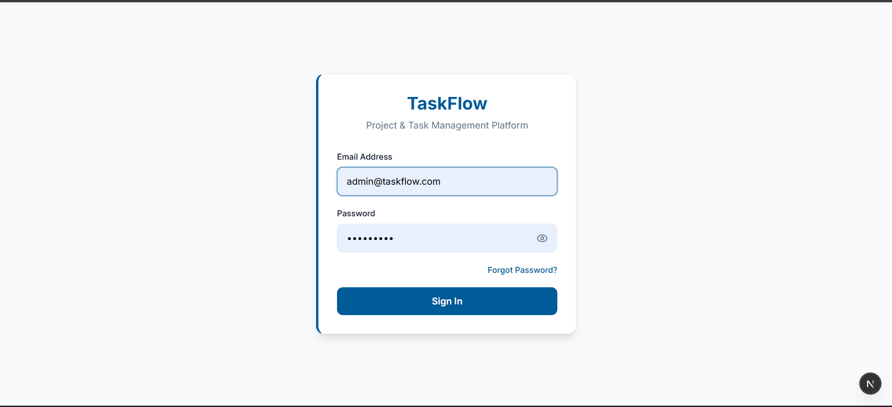
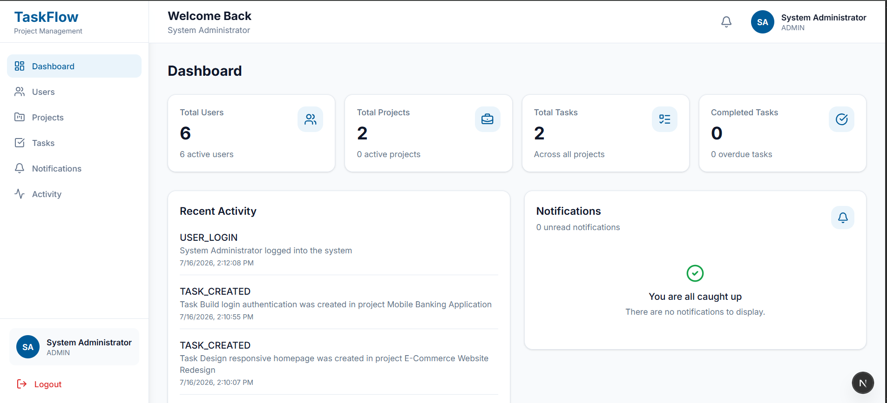
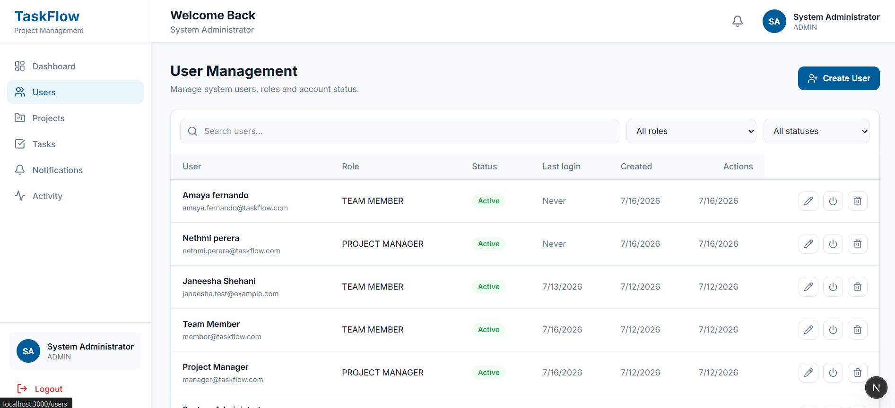
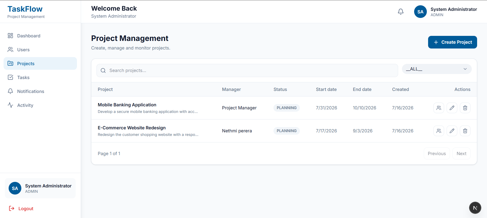
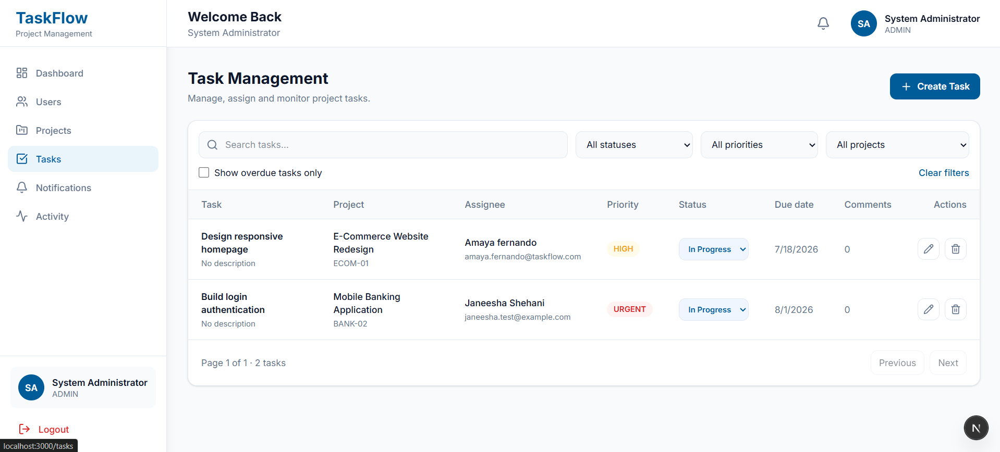
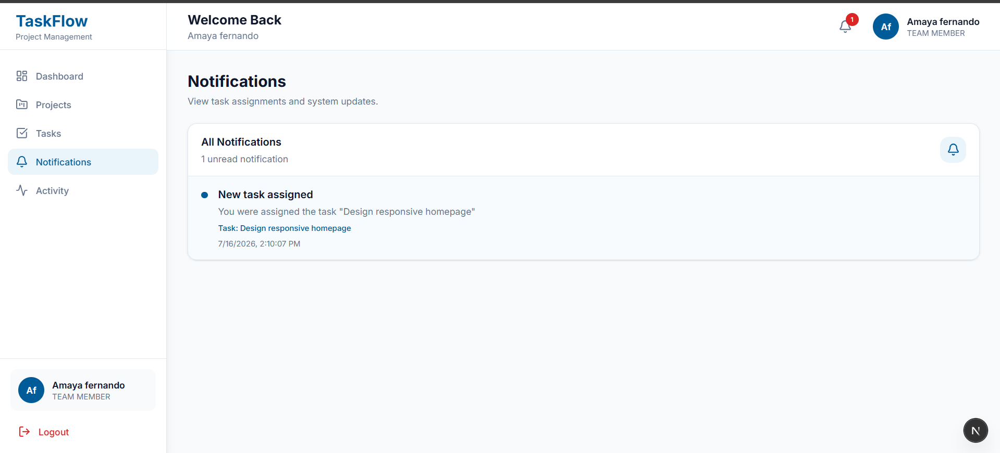

# 🚀 TaskFlow - Project & Team Task Management Platform

A full-stack Project and Team Task Management Platform built with **Next.js, Node.js, Express, Prisma, and PostgreSQL**. The system allows administrators, project managers, and team members to collaborate efficiently through role-based access control, project management, task assignment, notifications, and activity tracking.

---

## 📖 Project Overview

TaskFlow is designed to help organizations manage projects and team tasks in one centralized platform.

The application supports three user roles:

- **System Administrator**
- **Project Manager**
- **Team Member**

Each role has different permissions, ensuring secure access to system features.

---

# ✨ Features

## 🔐 Authentication & Authorization

- JWT Authentication
- Secure Login
- Role-Based Access Control (RBAC)
- Protected Routes

---

## 👤 User Management (Admin)

- Create Users
- Edit Users
- Activate / Deactivate Users
- Delete Users
- Search Users
- Filter by Role
- Filter by Status

---

## 📁 Project Management

- Create Projects
- Edit Projects
- Delete Projects
- Search Projects
- Filter Projects
- Project Status Management

---

## 👥 Project Members

- Add Team Members to Projects
- Remove Members
- View Assigned Members

---

## ✅ Task Management

- Create Tasks
- Edit Tasks
- Delete Tasks
- Assign Tasks
- Change Task Status
- Priority Management
- Due Dates

---

## 🔔 Notifications

- Notification Page
- Unread Count
- Task Assignment Notifications

---

## 📊 Dashboard

- Total Users
- Active Projects
- Total Tasks
- Completed Tasks
- Recent Activity

---

## 📜 Activity Logs

- User Login Activity
- Task Updates
- Project Updates
- System Activity History

---

## 📱 Responsive Design

- Desktop
- Tablet
- Mobile

---

# 🛠 Tech Stack

## Frontend

- Next.js
- React
- TypeScript
- Tailwind CSS
- React Query
- React Hook Form
- Zod
- Lucide Icons

---

## Backend

- Node.js
- Express.js
- TypeScript
- Prisma ORM
- JWT Authentication
- Bcrypt

---

## Database

- PostgreSQL

---

## Tools

- Postman
- Git
- GitHub
- VS Code

---

# 📂 Project Structure

```
taskflow-management-platform/
│
├── frontend/
│   ├── src/
│   │   ├── app/
│   │   ├── components/
│   │   ├── services/
│   │   ├── providers/
│   │   ├── hooks/
│   │   ├── lib/
│   │   ├── types/
│   │   └── styles/
│   │
│   └── public/
│
├── backend/
│   ├── prisma/
│   ├── src/
│   │   ├── controllers/
│   │   ├── services/
│   │   ├── middleware/
│   │   ├── routes/
│   │   ├── validators/
│   │   ├── utils/
│   │   └── types/
│   │
│   └── uploads/
│
└── README.md
```

---

# ⚙️ Installation

## Clone Repository

```bash
git clone https://github.com/janeeshaShehani/taskflow-management-platform.git
```

```
cd taskflow-management-platform
```

---

## Backend

```
cd backend
npm install
```

Create `.env`

```
DATABASE_URL=your_postgresql_database_url

JWT_SECRET=your_secret_key

PORT=5000
```

Run

```
npx prisma migrate dev

npm run dev
```

---

## Frontend

```
cd frontend

npm install

npm run dev
```

Application

```
http://localhost:3000
```

Backend API

```
http://localhost:5000
```

---

# 🔗 API Endpoints

## Authentication

| Method | Endpoint | Description |
|----------|----------------|----------------|
| POST | /api/auth/login | User Login |

---

## Users

| Method | Endpoint |
|----------|-------------------------|
| GET | /api/users |
| POST | /api/users |
| PATCH | /api/users/:id |
| DELETE | /api/users/:id |

---

## Projects

| Method | Endpoint |
|----------|-----------------------------|
| GET | /api/projects |
| POST | /api/projects |
| PATCH | /api/projects/:id |
| DELETE | /api/projects/:id |

---

## Project Members

| Method | Endpoint |
|----------|-----------------------------------------|
| GET | /api/projects/:id/members |
| POST | /api/projects/:id/members |
| DELETE | /api/projects/:id/members/:userId |

---

## Tasks

| Method | Endpoint |
|----------|----------------------|
| GET | /api/tasks |
| POST | /api/tasks |
| PATCH | /api/tasks/:id |
| DELETE | /api/tasks/:id |

---

## Notifications

| Method | Endpoint |
|----------|---------------------------|
| GET | /api/notifications |
| PATCH | /api/notifications/read |

---

## Activity

| Method | Endpoint |
|----------|---------------------|
| GET | /api/activity |

---

# 📸 Screenshots

Add screenshots here after uploading them to GitHub.

Example:

```
screenshots/

login.png

dashboard.png

users.png

projects.png

tasks.png

notifications.png

activity.png

mobile-dashboard.png
```

Then display them like:

```markdown
## Login



## Dashboard



## Users



## Projects



## Tasks



## Notifications


```

---

---

| Role                | Email                  | Password      |
| ------------------- | ---------------------- | ------------- |
| **Administrator**   | `admin@taskflow.com`   | `Admin@123`   |
| **Project Manager** | `manager@taskflow.com` | `Manager@123` |
| **Team Member**     | `member@taskflow.com`  | `Member@123`  |

---

## 👨‍💻 Developer

Janeesha Shehani
University of Kelaniya
BSc (Hons) Computer Science
Linkedin    : www.linkedin.com/in/janeesha-divyanjalee-b3a841355
GitHub      : https://github.com/janeeshaShehani